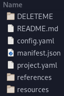

# Mason-Quickstart
A template repository to quickly get started on a Mason project. 

## Prerequisites
- [Mason](https://github.com/H3VR-Modding/Mason): creates a DLL from the project.yaml, manifest.json, and resources
- [Visual Studio Code](https://code.visualstudio.com): ensures your JSON and YAML files are valid, and provides an easy way to build and pack
  - [YAML extension](https://marketplace.visualstudio.com/items?itemName=redhat.vscode-yaml): brings the extensive autocomplete and error checking of JSON files to YAML files

## Getting Started
There are 2 basic ways to store Mason projects: locally (on your computer only) and on GitHub. Locally is easier to begin with, but means other people cannot contribute to your project.

### Locally
Click "Code", then "Download ZIP":  

Open the zip and there will be a `Mason-Quickstart-main` folder. Enter it, then drag and drop the files and folders within to a folder of your choosing. Your folder should look something like this:  

You now have the files downloaded. Go to [Usage/Both](#both) to continue.

### With GitHub
Click "Use this template" to create a copy of this repository to your GitHub profile.  

Clone your new repository. If you have not used git before, [GitHub Desktop](https://desktop.github.com/) is a good client to begin with.

You now have a repository and it cloned. Go to [Usage/Both](#both) to continue.

## Adding Functionality
First, enter your basic mod information in [manifest.json](manifest.json). This information is used for both the Thunderstore package and resulting BepInEx plugin.  
Then, insert files and folders that your project will use in [resources](resources). Insert as many as you want; only resources referenced by your project will be included in the final result.  
Finally, describe how resources should be loaded in [project.yaml](project.yaml).

## Building
To build, press CTRL + SHIFT + B, select `build bootstrap.dll` using your arrow keys (if it is not already selected), and press enter. This will produce [output/bootstrap.dll](output/bootstrap.dll). This is the compiled code that will load your assets.

## Packing
To pack, press CTRL + SHIFT + B, select `pack Thunderstore mod` using your arrow keys, and press enter. This will produce [output/mod.zip](output/mod.zip). This file can be uploaded to Thunderstore, or locally imported via r2modman.

**Before uploading**, you should delete everything in this README.md file and start anew. This is the file that users will see on your Thunderstore webpage. If you are unfamiliar with Markdown, see [this helpful site](https://www.markdownguide.org/cheat-sheet/). Additionally, you need an [icon.png](icon.png) file within this directory.  
You should also delete the [DELETEME](DELETEME) folder. This contains images used within this file, which won't be needed anymore.